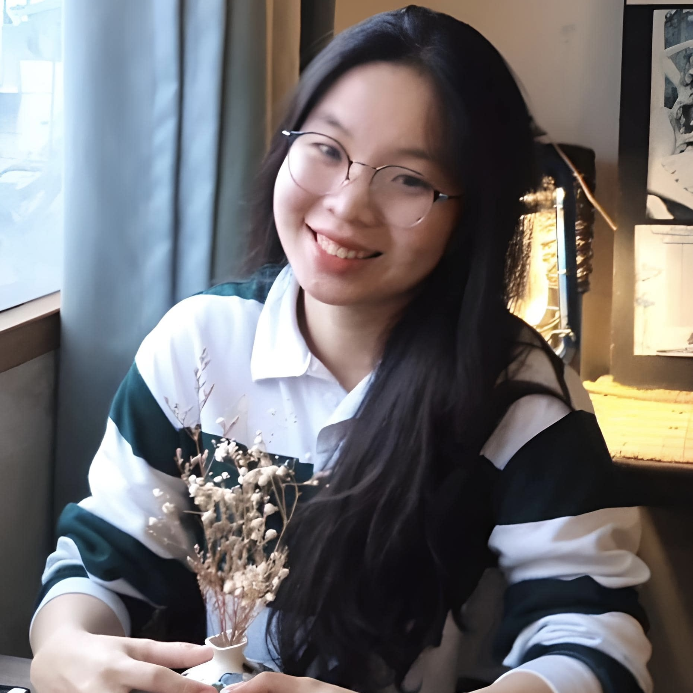

---
# Feel free to add content and custom Front Matter to this file.
# To modify the layout, see https://jekyllrb.com/docs/themes/#overriding-theme-defaults

layout: post
bibliography: pub.bib
---

Profiles: [LinkedIn](https://www.linkedin.com/in/hale30/)

I am Ha, an Computer Science undergrad at Fulbright University Vietnam. I am interested in studying the Data Science and AI. I am actively looking for internship opportunities in DS and AI for this summer 2023. My current project is about applying machine learning in analyzing stock market.

# Projects
- Vietnam and US stock market prediction.
- FUV course scheduling.
- Adapting to Climate Change by Improving Extreme Weather Forecasts.
- Data Science book analysis.

# Experiences
- I am working as a Teaching Assistant in Computer Science and Math at Fulbright Universoty Vietnam. 
- I was a Research Assistant at [Union Technical Outsource](https://utovn.com.au/) (HCMC, Vietnam, 2022 - 2023).
- I'm practicing Competitive Programming and competed at national level. ([my CodeForces profile](https://codeforces.com/profile/minnnnnn))

# Featured articles
- (Vietnamese) https://baoquangnam.vn/giao-duc/tang-thuong-quy-uom-mam-tai-nang-dat-quang-lan-thu-xii-nam-2021-nhung-cao-thu-mon-hoa-hoc-116696.html
